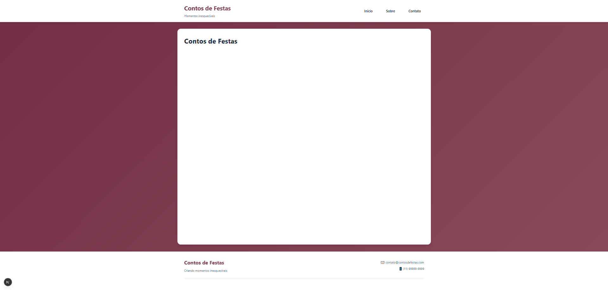
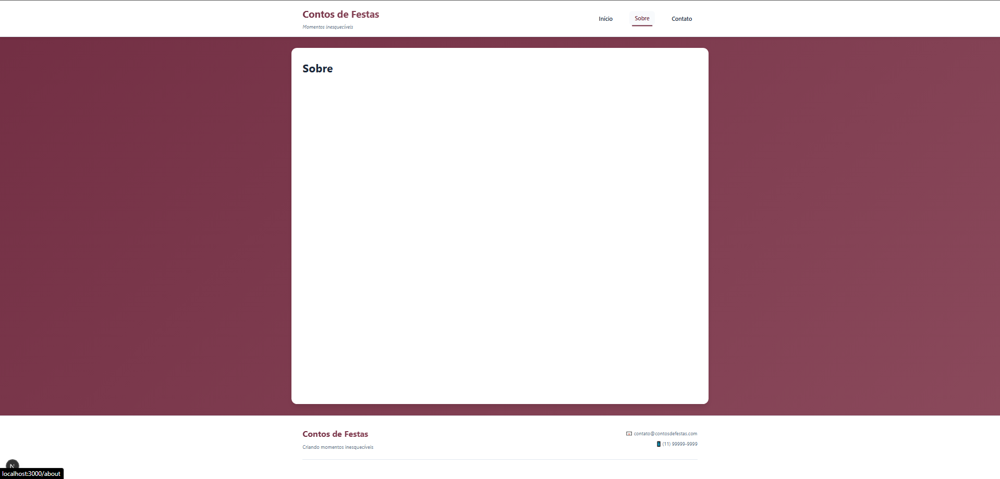
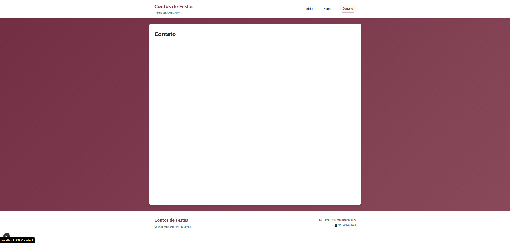

# Contos de Festa

## Web Mobile

### - Matteo Domiciano Varnier -10390247
### - Fernando Pegoraro Bilia – 10402097
### - Rodrigo Barbosa – 10748173

#### São Paulo, SP

# Protótipo

# Motivação do projeto
No Conto de Festas, acreditamos que cada celebração merece ser única e inesquecível. A ideia de criar este espaço surgiu para facilitar a forma de apresentar nossos trabalhos e tornar a escolha dos clientes ainda mais prática. Assim, reunimos em um só lugar todos os nossos kits de festas completos, prontos para transformar momentos especiais em memórias duradouras. Nosso compromisso é tornar cada festa prática, divertida e visualmente incrível, cuidando de todos os detalhes para que você possa aproveitar o momento sem preocupações. Com o Conto de Festas, transformar sonhos em realidade nunca foi tão fácil!

# Caráter extensionistas
O Conto de Festas nasce como uma iniciativa de extensão que conecta o conhecimento acadêmico (tecnologia, design e gestão) às necessidades reais do mercado local de festas. O projeto promove a aplicação prática do saber por meio do desenvolvimento de uma plataforma que organiza o portfólio, padroniza a apresentação de kits e facilita o atendimento, ampliando a visibilidade digital e a profissionalização do negócio. Com isso, o site gera impacto social ao fortalecer um empreendimento local, melhorar processos (catálogo, orçamento e comunicação) e tornar o serviço mais acessível aos clientes. Ao mesmo tempo, oferece aos estudantes um ambiente de aprendizagem situada, envolvendo análise de requisitos, usabilidade, métricas de atendimento e melhoria contínua, em diálogo direto com a comunidade.

# Como foi feito o código

1. Projeto inteiro foi feito em um editor de código (Visual Studio Code)

2. Foi instalado o node.js

5. README.md para mostrar mais sobre o código

# Rodar o Código

1. Va para o editor

2. Abra o **Conto de festas**

3. npm install

4. Digite no terminal
   - `run dev run`